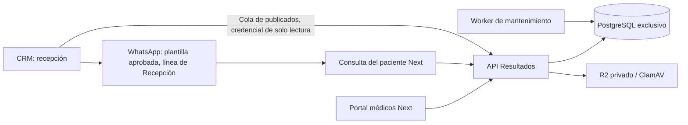

# Resultados Montalvo

**Continuar desde otra máquina:** leer [CONTEXTO_CONTINUIDAD.md](CONTEXTO_CONTINUIDAD.md) para conocer el estado desplegado, los pendientes y los archivos privados que no viajan con Git.

API independiente para que médicos registren pacientes por CI/PAC, adjunten un PDF de ecografía, lo revisen y lo publiquen para consulta privada del paciente. El CRM no autentica médicos ni almacena informes.

**Estado:** backend y portal independiente Next desplegados y verificados en https://resultados.107.175.132.15.nip.io/. El portal está en `portal/` y conserva la identidad visual de la web institucional. **Este proyecto no envía WhatsApp**: el aviso al paciente lo manda recepción desde el CRM (ver *Entrega al paciente*).

## Arquitectura y alcance

Un backend modular, una base PostgreSQL exclusiva, almacenamiento privado y dos procesos: API y worker de mantenimiento (purga horaria de sesiones vencidas). Sin microservicios adicionales, Redis ni dependencias del código del CRM. Resultados es el primer dominio; reservas, pagos y agenda no están implementados ni contienen tablas vacías.



Separar la API protege los límites del producto. Para aislar también CPU/RAM se necesita otro servidor o límites de recursos: carpetas y procesos separados por sí solos no ofrecen ese aislamiento.

## Desarrollo local

Requisitos: Node 22.12+ (recomendado 24), npm, PostgreSQL. No usar la base, el usuario ni las claves del CRM.

1. `npm ci --ignore-scripts`
2. Copiar `.env.example` a `.env`; crear una base llamada `resultados` y un usuario exclusivo con acceso únicamente a esa base.
3. Completar `RESULTADOS_DATABASE_URL`, `SESSION_HMAC_KEY` (generar con `openssl rand -hex 32`), `PATIENT_PORTAL_URL` y `CORS_ORIGINS`.
4. `npm run build`
5. `npm run migrate`
6. Crear el primer administrador con `npm run usuario -- admin@tu-dominio.com "Administrador" ADMIN`. La contraseña se lee de stdin (12–128 caracteres); en una terminal usar entrada oculta o un gestor de secretos, nunca argumentos ni historial del shell.
7. `npm start` y, en otro proceso, `npm run worker` (limpieza horaria).

API predeterminada: puerto 3010. `/health` comprueba proceso; `/health/ready` comprueba PostgreSQL. El portal está en `portal/` y utiliza el puerto 3011. Consulta [su arranque](portal/README.md). Las URL de ejemplo son locales. La instalación del servidor usa HTTPS, PDFs cifrados y antivirus.

`STORAGE_DRIVER=local` guarda PDFs en `var/private`, fuera de recursos públicos. Sin ClamAV solo se permite desarrollo; producción exige R2 privado o `STORAGE_DRIVER=local-encrypted` con clave AES-256-GCM y `CLAMAV_HOST`. Nunca usar PDFs clínicos reales en desarrollo sin el entorno adecuado.

## Flujo ya disponible

1. Administrador crea cuentas `MEDICO`; cada médico consulta solamente sus informes. Administrador puede consultar todos.
2. Médico busca un paciente por CI **o** PAC exacto; si no existe, registra nombre y al menos un identificador. Registrar el PAC cuando se conozca: es la clave con la que el CRM reconoce al paciente sin dudas. No se pide teléfono: el aviso sale del CRM al número de la conversación real.
3. Crea el informe con estudio y fecha. La API genera el enlace del paciente; no hay código que entregar.
4. Adjunta un PDF válido de hasta 10 MB y 300 páginas. Puede sustituirlo mientras sea borrador, usando la revisión actual.
5. Revisa identidad y PDF y publica. Publicar pone el informe en la cola de recepción del CRM; no envía nada por sí mismo.
6. El paciente toca el botón del WhatsApp y ve su informe, sin escribir nada: **el enlace es la llave** (decidido con la clínica el 2026-09-23; el código de 12 caracteres en papel era el paso que más lo frenaba). Su sesión dura 15 minutos y solo permite consultar ese informe. El enlace vence a los 30 días; el médico o recepción (desde el CRM) lo extienden sin cambiarlo.
7. Si hubo un error, retirar revoca acceso y sesiones y saca el informe de la cola del CRM. Para corregir un informe publicado, retirar y crear otro: no se modifica silenciosamente un resultado ya entregado.

La confirmación humana comprueba que el PDF pertenece al paciente: la API valida el archivo, pero no interpreta su contenido médico ni verifica una identidad civil.

## Entrega al paciente

El CRM es el **único emisor** de WhatsApp (decidido el 2026-09-22): una sola app de Meta, un solo webhook, y el mensaje queda en la conversación del paciente, así que si responde lo ve quien atiende. Recepción ve en el CRM la cola de informes publicados (`GET /v1/integraciones/crm/informes`) y envía la plantilla `montalvo_informe_disponible` con un botón al enlace del informe. El mensaje lleva el enlace, nunca el código, el PDF, el diagnóstico ni el CI.

Hasta esa fecha este proyecto tenía su propio camino de avisos (transporte Meta, webhook, consentimiento al publicar, cola con reintentos). Nunca se encendió —cero avisos en producción— y se retiró entero: dos emisores para el mismo paciente habrían sido dos historiales y dos webhooks peleando por una sola URL. Especificación de la plantilla en [operación](docs/operacion.md).

## Contratos y documentación

- [API y conexión Next](docs/api.md)
- [Arquitectura, decisiones y límites](docs/arquitectura.md)
- [Auditoría UX y flujos propuestos](docs/ux-audit-v2.md)
- [Operación y puesta en marcha](docs/operacion.md)

## Verificación

`npm test` compila y ejecuta pruebas unitarias. Para integración, preparar una base local desechable llamada exactamente `resultados_test`, aplicar migraciones y ejecutar:

```sh
TEST_RESULTADOS_DATABASE_URL=postgresql://usuario@127.0.0.1:5432/resultados_test npm run test:integration
```

Las pruebas de integración vacían exclusivamente esa base; rechazan otro nombre o un host no local. Usan HTTP real, PostgreSQL real y PDFs sintéticos. No verifican conectividad real con R2/ClamAV ni rendimiento bajo carga clínica.

Dependencias fijadas en el lockfile. Los overrides de `deepmerge-ts` y `mysql2` corrigen dependencias transitivas de Prisma 7; retirarlos cuando una actualización estable resuelva los avisos y pase las pruebas. No actualizar a una versión candidata de Prisma para evitar un override.
