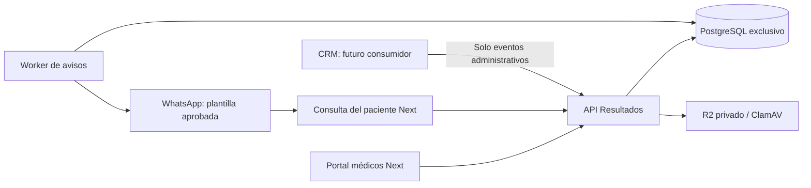

# Resultados Montalvo

API independiente para que médicos registren pacientes por CI/PAC, adjunten un PDF de ecografía, lo revisen y lo publiquen para consulta privada del paciente. El CRM no autentica médicos ni almacena informes.

**Estado:** backend y portal independiente Next implementados y probados localmente. No desplegados. El portal está en `portal/` y conserva la identidad visual de la web institucional. WhatsApp viene desactivado; no se ha enviado ningún mensaje ni solicitado aprobación de una plantilla desde este proyecto.

## Arquitectura y alcance

Un backend modular, una base PostgreSQL exclusiva, almacenamiento privado y dos procesos: API y worker de avisos. Sin microservicios adicionales, Redis ni dependencias del código del CRM. Resultados es el primer dominio; reservas, pagos y agenda no están implementados ni contienen tablas vacías.



Separar la API protege los límites del producto. Para aislar también CPU/RAM se necesita otro servidor o límites de recursos: carpetas y procesos separados por sí solos no ofrecen ese aislamiento.

## Desarrollo local

Requisitos: Node 22.12+ (recomendado 24), npm, PostgreSQL. No usar la base, el usuario ni las claves del CRM.

1. `npm ci --ignore-scripts`
2. Copiar `.env.example` a `.env`; crear una base llamada `resultados` y un usuario exclusivo con acceso únicamente a esa base.
3. Completar `RESULTADOS_DATABASE_URL`, `SESSION_HMAC_KEY` (generar con `openssl rand -hex 32`), `PATIENT_PORTAL_URL` y `CORS_ORIGINS`.
4. `npm run build`
5. `npm run migrate`
6. Crear el primer administrador con `npm run usuario -- admin@tu-dominio.com "Administrador" ADMIN`. La contraseña se lee de stdin (12–128 caracteres); en una terminal usar entrada oculta o un gestor de secretos, nunca argumentos ni historial del shell.
7. `npm start` y, en otro proceso, `npm run worker`.

API predeterminada: puerto 3010. `/health` comprueba proceso; `/health/ready` comprueba PostgreSQL. El portal está en `portal/` y utiliza el puerto 3011. Consulta [su arranque](portal/README.md). Las URL de ejemplo son locales; todavía no hay un sitio clínico desplegado.

`STORAGE_DRIVER=local` guarda PDFs en `var/private`, fuera de recursos públicos. Sin ClamAV solo se permite desarrollo; producción exige `STORAGE_DRIVER=r2` y `CLAMAV_HOST`. Nunca usar PDFs clínicos reales en desarrollo sin el entorno adecuado.

## Flujo ya disponible

1. Administrador crea cuentas `MEDICO`; cada médico consulta solamente sus informes. Administrador puede consultar todos.
2. Médico busca un paciente por CI **o** PAC exacto; si no existe, registra nombre y al menos un identificador. Teléfono solo si se usará WhatsApp.
3. Crea el informe con estudio y fecha. La API entrega una vez el código de consulta y el enlace. Entregar ambos al paciente en la clínica; el código no debe enviarse dentro de la misma notificación.
4. Adjunta un PDF válido de hasta 10 MB y 300 páginas. Puede sustituirlo mientras sea borrador, usando la revisión actual.
5. Revisa identidad y PDF; publica con o sin aviso. Publicar no significa que WhatsApp se haya enviado.
6. El paciente usa enlace + código; su sesión dura 15 minutos y solo permite consultar ese informe. El acceso vence a los 30 días; el médico puede renovarlo.
7. Si hubo un error, retirar revoca acceso y sesiones y cancela avisos aún pendientes. Para corregir un informe publicado, retirar y crear otro: no se modifica silenciosamente un resultado ya entregado.

La confirmación humana comprueba que el PDF pertenece al paciente: la API valida el archivo, pero no interpreta su contenido médico ni verifica una identidad civil.

## WhatsApp y costos

La plantilla propuesta y la activación se describen en [operación](docs/operacion.md). `NOTIFICATIONS_ENABLED=false` por defecto. Hay que elegir una línea, obtener la aprobación de Meta, registrar consentimiento y configurar credenciales antes de activar.

No se requiere que el paciente haya escrito previamente si se utiliza una plantilla aprobada y se cumplen los requisitos aplicables de WhatsApp. No se promete gratuidad ni aprobación automática. No enviar diagnóstico, PDF, CI o código de acceso en la plantilla.

El backend admite un aviso por informe. Publicar y autorizar en paralelo no duplica ese aviso. Solo se reintentan rechazos transitorios explícitos, hasta tres intentos; un timeout queda `INCIERTO` y no se repite automáticamente. El límite diario cuenta intentos, no bolivianos, y se reinicia a medianoche UTC.

## Contratos y documentación

- [API y conexión Next](docs/api.md)
- [Arquitectura, decisiones y límites](docs/arquitectura.md)
- [Auditoría UX y flujos propuestos](docs/ux-audit-v2.md)
- [Operación y puesta en marcha](docs/operacion.md)

## Verificación

`npm test` compila y ejecuta pruebas unitarias. Para integración, preparar una base local desechable llamada exactamente `resultados_test`, aplicar migraciones y ejecutar:

```sh
TEST_RESULTADOS_DATABASE_URL=postgresql://usuario@127.0.0.1:5432/resultados_test npm run test:integration
```

Las pruebas de integración vacían exclusivamente esa base; rechazan otro nombre o un host no local. Usan HTTP real, PostgreSQL real, PDFs sintéticos y transporte WhatsApp simulado. No verifican conectividad real con Meta/R2/ClamAV ni rendimiento bajo carga clínica.

Dependencias fijadas en el lockfile. Los overrides de `deepmerge-ts` y `mysql2` corrigen dependencias transitivas de Prisma 7; retirarlos cuando una actualización estable resuelva los avisos y pase las pruebas. No actualizar a una versión candidata de Prisma para evitar un override.
